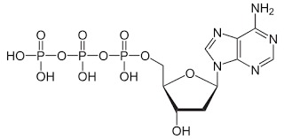

# Lecture 1

**Local Alignment (BLAST) and Statistics**

* **Local Alignment** 
    * A simple BLAST-like algorithm
    * Statistics of matching
    * Target frequencies & mismatch penalties for nucleotide alignment

* **Sequencing**
    * Conventional
    * 2nd Generation

Sequencing is mostly done at the level of DNA, whether the original material was RNA or not (converted to DNA then sequenced)

#### Types of Nucleotides

* Ribonucleotide
* Deoxyribonucleotide
* Dideoxyribonucleotide

#### Ribonucleotide chemical structure 

#### Deoxyribonucleotide chemical structure 

#### Dideoxyribonucleotide chemical structure 

* **Carbon 1:** is the one where the base is attached.
* **Carbon 2:** has OH in RNA & H in DNA (H is "bare" in the growing chain)
* **Carbon 3:** is where we extend (the next base in the growing chain)
* **Carbon 5:** connects to the phosphate, which will then connect the base to the sugar-phosphate backbone

#### Sanger Sequencing

* **What will happen if you give DNA polymerase a template & some dideoxynucleotides?** 
    * It won't be able to extend because there's no 3'-OH.
    * This is the basis of Sanger sequencing (chain termination sequencing).
    * This technique takes advantage of the special property of dideoxynucleotides (ddNTPs): they terminate the growing chain.

#### Steps in Sanger Sequencing

1. **DNA Template:** 5'-NNN CAT GAG ACA GTC...
2. **Primer Annealing:** A primer (5'-NNN) is designed to bind to the template.
3. **DNA Synthesis:** DNA polymerase extends the primer, incorporating nucleotides.
4. **Repeat 2 & 3:** This is done in four separate reactions, each with a different ddNTP (ddATP, ddCTP, ddGTP, ddTTP).
5. **Fragmentation:** The ddNTPs terminate the growing chain at different points, creating fragments of varying lengths.
6. **Separation by Size:** Fragments are separated by size using gel electrophoresis.
7. **Sequence Determination:** The sequence is read by detecting the fluorescent labels on the ddNTPs.

#### Key Concepts

* **Flanking sequences:**  These are the regions of DNA located immediately upstream (before) and downstream (after) a specific target sequence. They serve as reference points for primer binding and provide context for the target DNA.

* **Dideoxynucleotides:** These are nucleotides that lack a 3'-OH group. When incorporated into a growing DNA strand, they terminate further extension. This property is exploited in Sanger sequencing to generate DNA fragments of different lengths.
### Sanger Sequencing

The DNA template is cloned into some vector (like a phage vector) for sequencing so you know the flanking sequences. And then you do 4 sequencing reactions in conventional Sanger sequencing.

#### Steps of Sanger Sequencing

1. **Template DNA:** From the organism/sample we are sequencing.
2. **Primer:** A short, complementary DNA sequence to the template.
3. **DNA Polymerase:** Usually a heat-stable enzyme like Taq polymerase.
4. **dNTPs:** The normal nucleotides (A, T, C, G).
5. **ddNTPs:**  Block the 3'-OH group and cause chain termination when incorporated.
6. **Buffer Solution:** To provide optimal pH and ionic strength for the reaction.

#### ddNTPs (dideoxynucleotide triphosphates)

* **ddATP:** dideoxy Adenosine Triphosphate
* **ddTTP:** dideoxy Thymidine Triphosphate
* **ddCTP:** dideoxy Cytidine Triphosphate
* **ddGTP:** dideoxy Guanosine Triphosphate

Each ddNTP is labeled with a different fluorescent dye, so the terminated fragments can be identified by the color they emit.
#### Sanger Sequencing: Understanding ddNTPs

By running 4 reactions—each with one ddNTP (ddATP, ddCTP, ddGTP, or ddTTP)—we generate fragments of varying lengths where chain termination occurred. The fragments are then separated by size using electrophoresis/capillary sequencing, and the sequence is determined by reading the order of fragments by size.

**"The one here with a ddGTP... so what would you put in that reaction?"**

In this reaction containing ddGTP, the ddGTP terminates the DNA synthesis at positions where the nucleotide should have been guanine. So after sequencing, we would look for fragments that ended at positions where guanine should have been added. These would be revealed by their fluorescent analysis (i.e., labels during the analysis).
#### Sanger Sequencing: Reaction Conditions and Gel Electrophoresis

In the buffer, the concentration of ddNTPs has to be much lower compared to the conventional nucleotides. Because you need enough of the ribonucleotide concentration so that the dNTPs are in excess and you are going to terminate the elongation at random points with ddNTPs, allowing for the generation of fragments of varying lengths for sequencing.

#### Gel Electrophoresis

In 4 separate reactions (each looking at one type of base A, T, C, G), the primers are radiolabeled. Then after a reaction to organize the DNAs, we put them in a gel, a kind of like a special slippery surface—"run" electricity through it. The DNA moves—the smaller pieces go faster than the bigger ones. When we add ddGTP, we are looking for places where the DNA sequence has the base G. Then in the lane where we put ddGTP, we would see the smaller products—the shortest DNA pieces that were created by stopping at G. We read these from the bottom up—the smallest pieces are at the bottom of the gel, the bigger ones are at the top—we read the sequence starting from the bottom to the top.
#### Sanger Sequencing: Interpreting the Gel

In this lane, there is a very small product that's just one base longer than the primer. That's because there was a C there and it terminated there (because we used ddGTP, it stopped after that C). The reaction terminates when the wrong nucleotide is added—G in this case—stopping the chain. And then the next C appears several bases later. This means that the next piece of DNA we read will show up a little further down the gel. There is a break (gap) in the sequence; we know that there is no G right after the first C. This helps us figure out the DNA sequence.

So you can see that the first base in the template would be a complement of T, or C. Because the C in the template would pair with a G in the new strand. So the first base we see in the new DNA strand would be a G, and in the original DNA, the first base is either T or C.

In the ddTTP lane, the next smallest fragment reveals that the following base in the sequence is A. By reading the gel from bottom to top, we can "snake" the way through the fragments, determining the DNA sequence step by step.